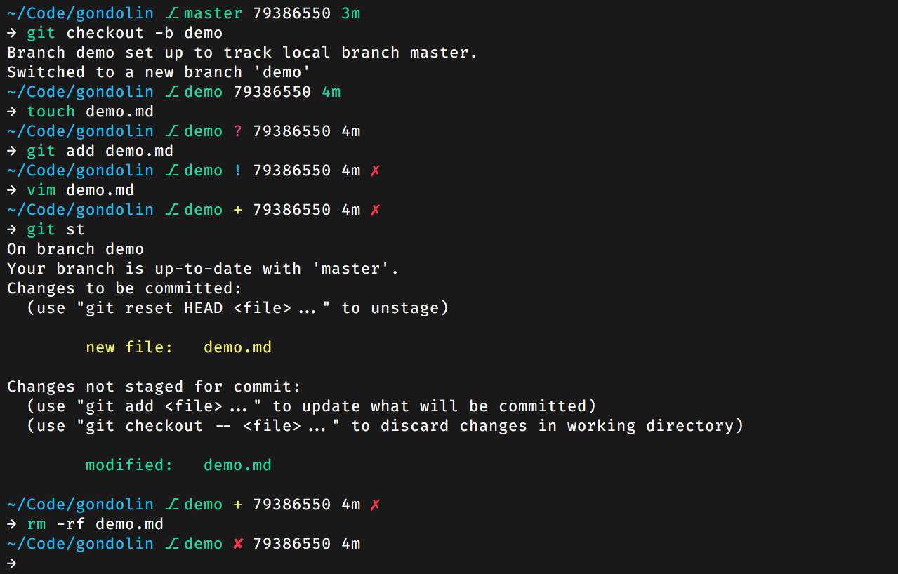

One of my passions in programming is for the console. Yes, the dim, graphically uninteresting block hole of the command-line. As a software developer, nearly all of my work is done inside of a terminal window. Aside from the occasional foray into [VS Code](https://code.visualstudio.com/), most of my work is done on or around the command-line. This encompasses everything from running and inspecting local Docker containers to UI development with React in vim. Because of this, I tend to think a lot about how to extend and customize the terminal. Particularly about how to make my work more productive and enjoyable.

For the past few years, `zsh` has been my default login shell of choice. As a devout Unix user, the z shell is a fairly easy choice when it comes to an easy to use and extensible bash alternative. I've even gone so far as to develop my own themes to further customize my shell. [One of those themes](https://github.com/tylerreckart/hyperzsh) has even gained a little popularity over the years.

It's a fast and stable choice when it comes to your home on the command-line. But, I think that sometimes we need to go out on a limb and try out something interesting.

This brings me to a few weeks ago when I discovered [Elvish](https://elv.sh). It looked like an interesting project with surprisingly thorough documentation. Although, a quick summary on my end wouldn't do the language justice. Here's how the Language's developer describes it:
> "Elvish is a cross-platform shell, supporting Linux, BSDs and Windows. It features an expressive programming language, with features like namespacing and anonymous functions, and a fully programmable user interface with friendly defaults. It is suitable for both interactive use and scripting."

Here are a few of the things that initially drew me into the project:
- The [Elvish Programming Language](https://elv.sh/ref/language.html) is clean, expressive, and powerful. An easy to comprehend syntax makes picking up the language a lot easier than you might expect. It supports name spaces, exception handling, and proper data structures.
- It already has a well-documented, rich [library of built-in functions](https://elv.sh/ref/builtin.html) to aid in the development of your project's architecture.
- Awesome interactive features like as-you-type syntax checking and highlighting, custom completions, directory & command history and more. There's even a built-in file explorer.

With the goal of configuring my own prompt in mind, I set out to learn Elvish. Building off of my previous shells, I used that time to develop [Gondolin](https://github.com/tylerreckart/gondolin)<a href="#1">[1]</a>. It's what I see as the next evolution of the git-centered prompt workflow that I have been developing over the past few years. What set the development of this prompt apart from the others was the difficulty involved. Elvish is still a very young language, and thus has a small ecosystem of libraries and modules.

I didn't have years of established methods to draw on. But, that didn't stop me. By [grokking](https://en.wikipedia.org/wiki/Grok) the implementations of these features in a shell I was already familiar with, I was able to use Elvish to completely reimplement features like a branch status readout or an actively-updated colorized timestamp of the last commit.

In the development of this prompt, I've really come to love Elvish. In fact, it's now my default login shell. To reiterate, the language is still in its infancy. The syntax is still a little wonky and backwards-incompatible changes still occur with relative frequency. If you're looking for absolute stability, Elvish might not be for you just yet.

With that being said, so far I am very happy with Elvish, and if this sort of thing interests you I encourage you to take a look. I'm looking forward to watching and contributing to the development of Elvish going forward.

***

1. **Gondolin** was a city in the J. R. R. Tolkien [legendarium](https://en.wikipedia.org/wiki/Tolkien%27s_legendarium), founded by the Elves. Found and founded with divine inspiration, it is hidden by mountains and endures for centuries before being betrayed and destroyed.